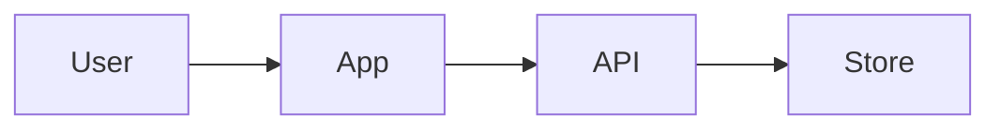

# Mermaid Architecture Map

## Apply

- `rules/structure-constraints.md`
- `rules/security-constraints.md` when secrets, trust boundaries, user data appear.

## Use When

- Multiple components/external services.
- Flow hard in prose.
- GitHub-renderable diagrams needed.
- Tool/trust/system boundary matters.

## Diagram Types

Simplest useful diagram:

- `flowchart LR` for architecture/boundaries.
- `sequenceDiagram` for request/agent flows.
- `stateDiagram-v2` for lifecycle.
- `graph TD` for dependencies.

## Rules

- Boundaries, not every file.
- Label external systems.
- Label trust boundaries.
- Label secret/user-data entry points.
- Small enough for PR review.

## Output

Create `.mmd`. Optional preview:

## Verify

- Balanced brackets/quotes.
- No unsupported Markdown inside labels.
- Readable node names.
