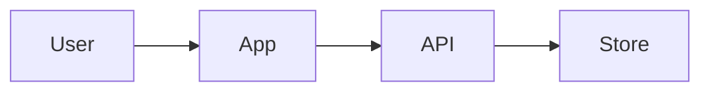

# Mermaid Architecture Map

## Rules To Apply

- `rules/structure-constraints.md`
- `rules/security-constraints.md` when secrets, trust boundaries, or user data appear.

## Use When

- A system has multiple components or external services.
- A flow is hard to understand in prose.
- A repo needs diagrams that render in GitHub Markdown.
- A tool, trust, or system boundary needs to be explicit.

## Diagram Types

Use the simplest diagram that explains the issue:

- `flowchart LR` for architecture and boundaries.
- `sequenceDiagram` for request or agent flows.
- `stateDiagram-v2` for lifecycle states.
- `graph TD` for dependency maps.

## Rules

- Show boundaries, not every file.
- Label external systems.
- Label trust boundaries.
- Label where secrets or user data enter.
- Keep diagrams small enough for PR review.

## Output Format

Create a `.mmd` file and optionally include a preview block:

## Verification

Check that the Mermaid syntax is valid enough for GitHub rendering:

- balanced brackets and quotes
- no unsupported Markdown inside labels
- readable node names
